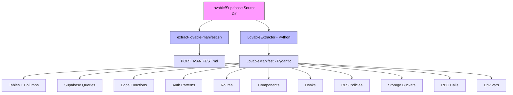
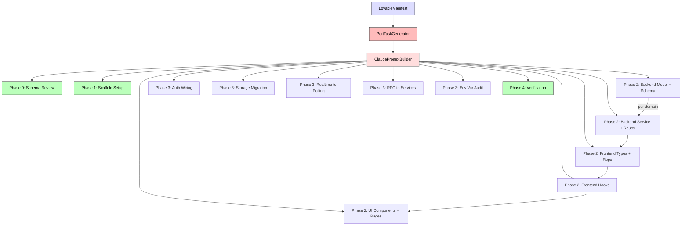
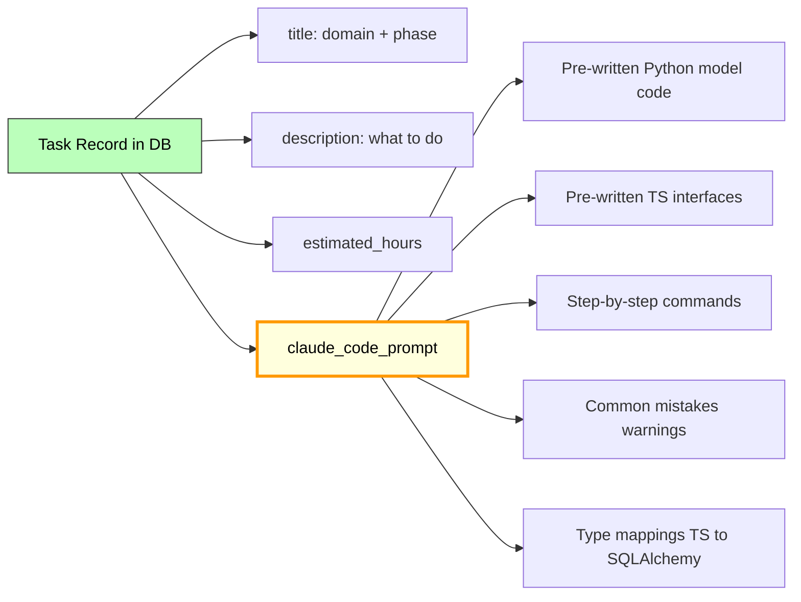
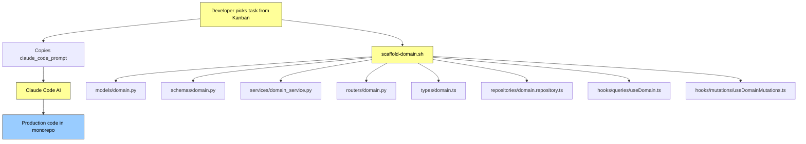
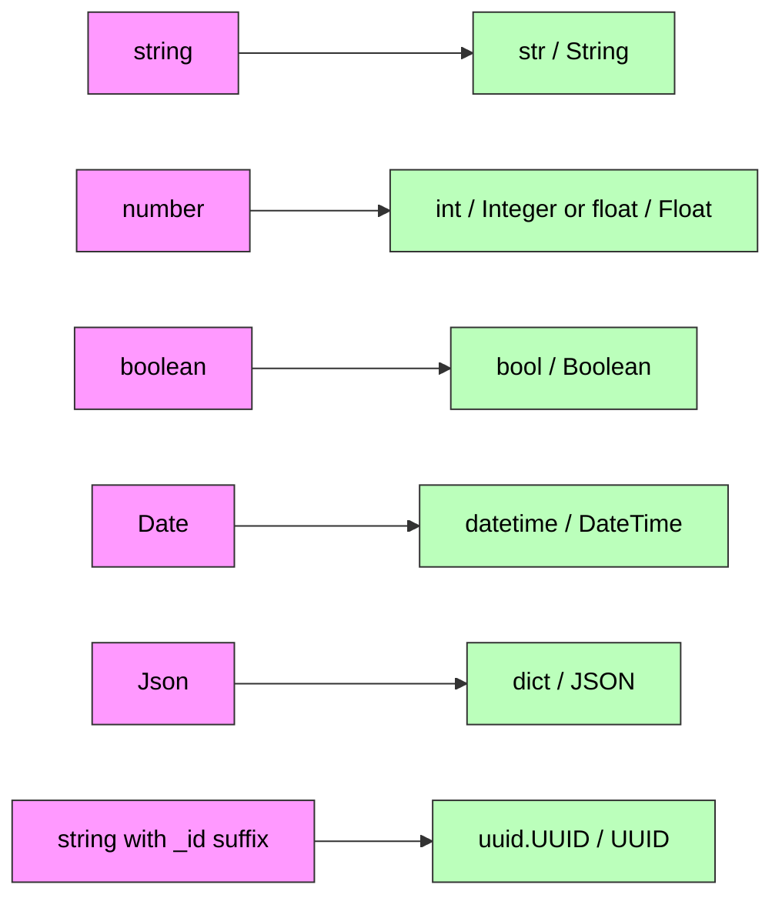
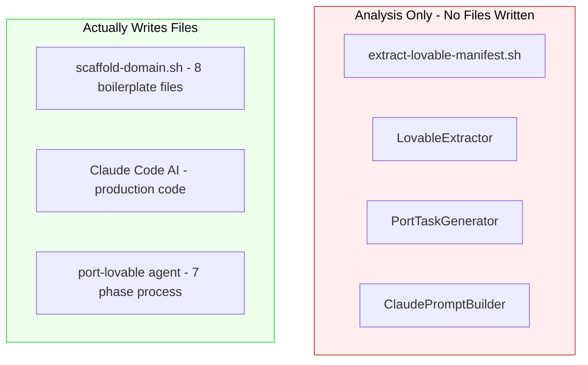

# Lovable Porting System - Architecture Diagrams

## 1. Simplified Pipeline

```mermaid
flowchart LR
    A[Lovable Source] -->|scan| B[LovableExtractor]
    B -->|manifest| C[PortTaskGenerator]
    C -->|tasks + prompts| D[Kanban Board]
    D -->|developer picks task| E[Claude Code]
    E -->|writes files| F[Monorepo Codebase]
    F -->|verify| G[verify-port.sh]

    style A fill:#f9f,stroke:#333,color:#000
    style B fill:#bbf,stroke:#333,color:#000
    style C fill:#fbb,stroke:#333,color:#000
    style D fill:#bfb,stroke:#333,color:#000
    style E fill:#ff9,stroke:#333,color:#000
    style F fill:#9cf,stroke:#333,color:#000
    style G fill:#9ff,stroke:#333,color:#000
```

---

## 2. Extraction Phase

---

## 3. Task Generation Phase

---

## 4. What Each Task Contains

---

## 5. Execution Phase

---

## 6. Type Mapping

---

## 7. Code Generation vs Analysis Only

